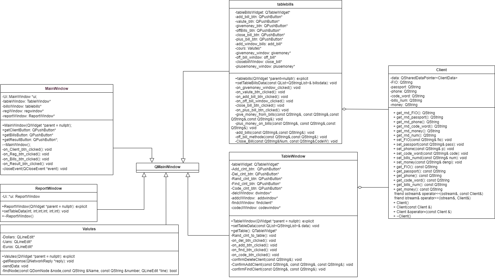
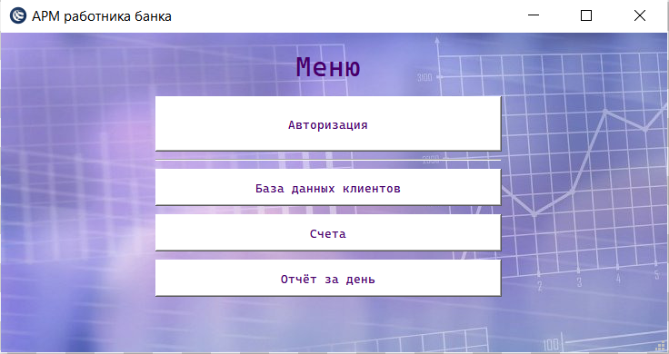
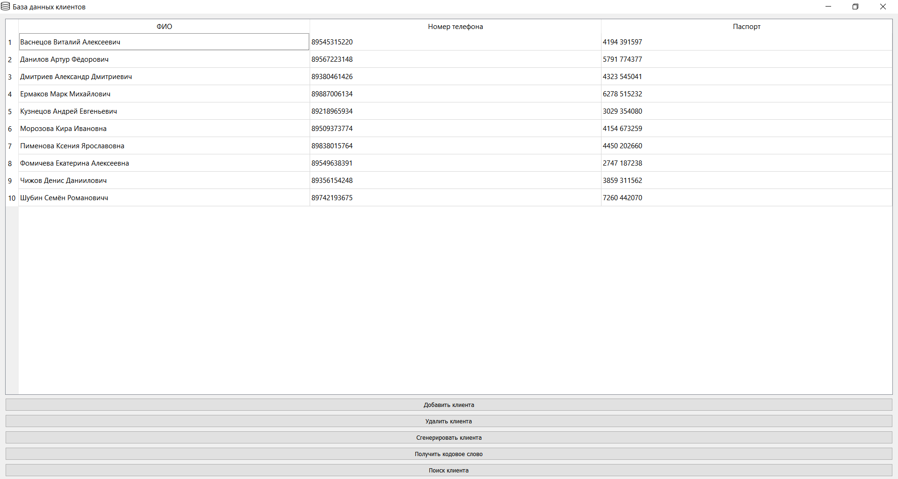
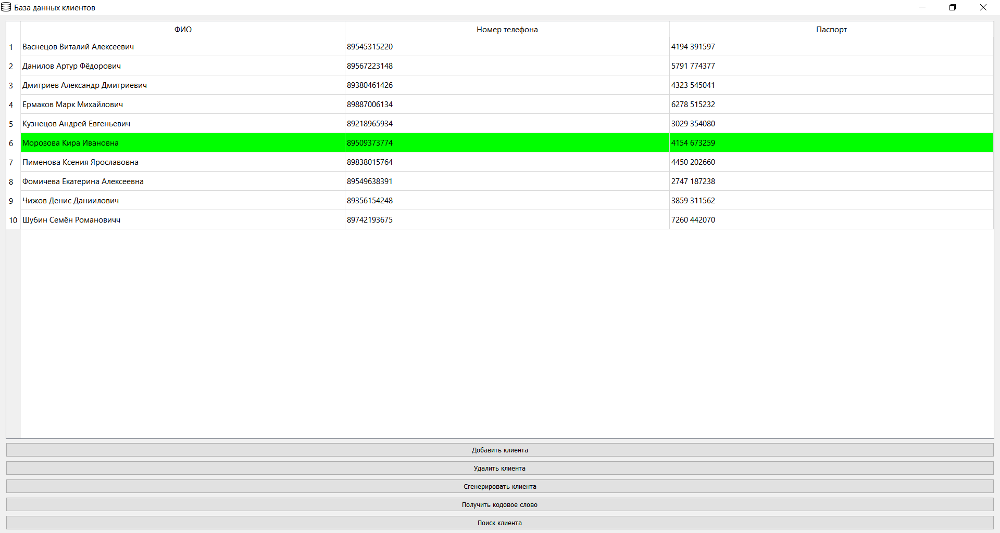
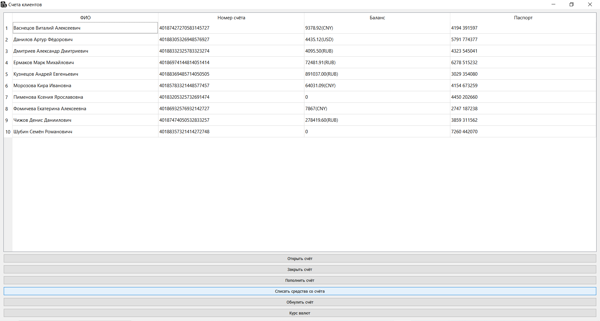
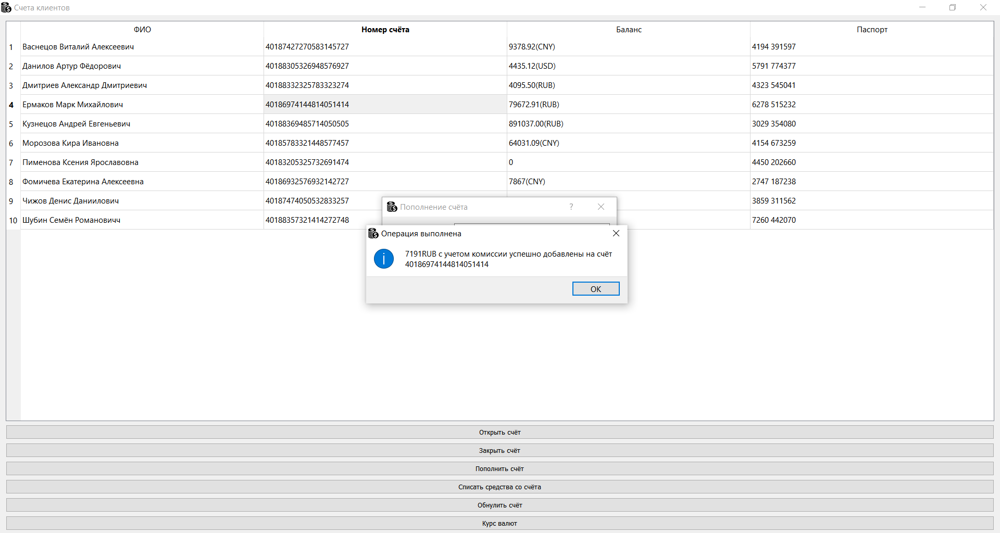
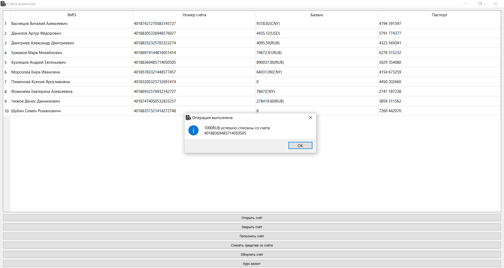
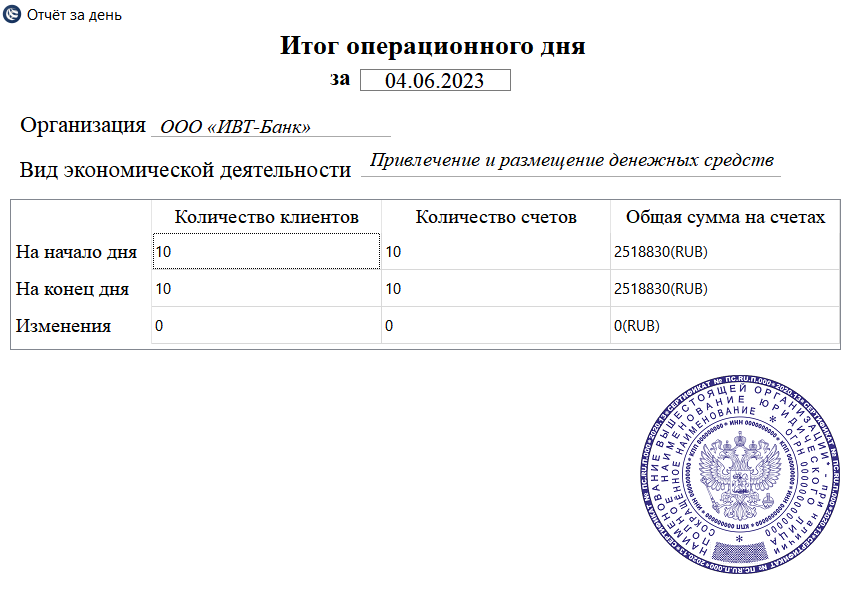

# ОТЧЁТ ПО ТЕМЕ "ТВОРЧЕСКАЯ РАБОТА"
# Автоматизированное рабочее место специалиста
## Постановка задачи
Реализовать автоматизированное рабочее место работника банка. 
Автоматизированное рабочее место (АРМ) – это приложение, разработанное для автоматизации и оптимизации рабочего процесса. Оно может включать в себя программное обеспечение для выполнения различных задач, аппаратные средства, такие как компьютер, монитор, клавиатура, мышь и другие периферийные устройства. АРМ может быть специально настроенным для выполнения конкретных задач, что позволяет повысить эффективность работы и сократить время на выполнение большинства задач.

В данном проекте должны быть представлены следующие функции:
-	Управление базой данных с клиентами.
-	Управление базой данных с счетами клиентов.
-	Связь с базой данных и обработка информации из неё.
-	Хранение информации внутри проекта и вне его.
-	Курс валют привязанный к сайту Центрально банка России.
-	Итоговый отчёт по операциям за день.

## Анализ задачи
Для обработки событий использован фреймворк ```Qt```. ```Qt``` - это кроссплатформенный фреймворк для разработки приложений с графическим интерфейсом пользователя *(GUI)* на языке программирования ```C++```.

В качестве баз данных были использован встроенный инструментарий ```Qt```, а именно виджет ```QTableWidget```, а также файлы с расширением ```.txt```.

Для обработки информации и её хранения, полученной из баз данных использовались следующие классы ```Qt```:
-	```QTableWidget``` - это класс в ```Qt```, который создаёт таблицу с необходимым количеством строк и столбцов, которые заполняются с помощью различных методов.
-	```QFile``` - это класс в ```Qt```, который позволяет работать с файлами на диске. Он позволяет открывать, создавать, записывать и читать файлы с помощью операций ввода-вывода.
-	```QDialog``` - это базовый класс диалоговых окон, все диалоговые окна в проекте являются производными от него.
-	```QPushButton```- это виджет, который предоставляет командную кнопку.
-	```QMessageBox``` - это широко используемый модальный диалог для отображения некоторого информационного сообщения.
-	```QmainWindow``` - это класс для отдельных окон приложения, которые могут содержать меню, панели, строку статуса.

Для курса валют:
-	```QDomNode``` - это класс в ```Qt```, который представляет узел в дереве ```XML-документа```. Он может быть использован для чтения, создания и изменения ```XML-документов```.
-	```QNetworkRequest``` - это класс в ```Qt```, который используется для создания и управления запросами к сетевым ресурсам.
-	```QNetworkAccessManager``` - это класс для создания и управления сетевыми запросами. ```QNetworkAccessManager``` предоставляет интерфейс для отправки сетевых запросов и получения ответов от серверов.
- ```QDate``` - это класс в ```Qt```, который используется для работы с датами. Он предоставляет методы для создания, изменения и форматирования даты.

## UML-диаграмма


## Скриншоты работы программы
Рисуонк 1 - Гавное меню программы


Рисунок 2 - Таблица с информацией о клиентах


Рисунок 3 - Работа с поиском клиентов в таблице


Рисунок 4 - Таблица с информацией о счетах клиентов


Рисунок 5 - Работа с функциями таблицы счетов (пополнение счёта)


Рисунок 6 - Работа с функциями таблицы счетов (списание средств)


Рисунок 7 - Отчёт за день

