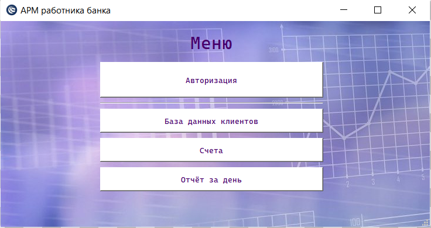
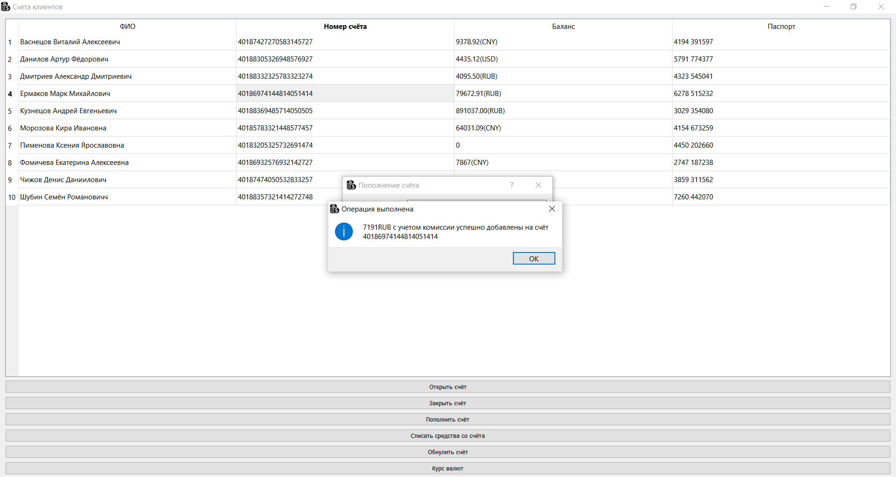

# ОТЧЁТ ПО ТЕМЕ "ТВОРЧЕСКАЯ РАБОТА"
# Автоматизированное рабочее место специалиста
## Постановка задачи
Реализовать автоматизированное рабочее место работника банка. 
Автоматизированное рабочее место (АРМ) – это приложение, разработанное для автоматизации и оптимизации рабочего процесса. Оно может включать в себя программное обеспечение для выполнения различных задач, аппаратные средства, такие как компьютер, монитор, клавиатура, мышь и другие периферийные устройства. АРМ может быть специально настроенным для выполнения конкретных задач, что позволяет повысить эффективность работы и сократить время на выполнение большинства задач.

В данном проекте должны быть представлены следующие функции:
-	Управление базой данных с клиентами.
-	Управление базой данных с счетами клиентов.
-	Связь с базой данных и обработка информации из неё.
-	Хранение информации внутри проекта и вне его.
-	Курс валют привязанный к сайту Центрально банка России.
-	Итоговый отчёт по операциям за день.

## Анализ задачи
Для обработки событий использован фреймворк ```Qt```. ```Qt``` - это кроссплатформенный фреймворк для разработки приложений с графическим интерфейсом пользователя *(GUI)* на языке программирования ```C++```.

В качестве баз данных были использован встроенный инструментарий ```Qt```, а именно виджет ```QTableWidget```, а также файлы с расширением ```.txt```.

Для обработки информации и её хранения, полученной из баз данных использовались следующие классы ```Qt```:
-	```QTableWidget``` - это класс в ```Qt```, который создаёт таблицу с необходимым количеством строк и столбцов, которые заполняются с помощью различных методов.
-	```QFile``` - это класс в ```Qt```, который позволяет работать с файлами на диске. Он позволяет открывать, создавать, записывать и читать файлы с помощью операций ввода-вывода.
-	```QDialog``` - это базовый класс диалоговых окон, все диалоговые окна в проекте являются производными от него.
-	```QPushButton```- это виджет, который предоставляет командную кнопку.
-	```QMessageBox``` - это широко используемый модальный диалог для отображения некоторого информационного сообщения.
-	```QmainWindow``` - это класс для отдельных окон приложения, которые могут содержать меню, панели, строку статуса.

Для курса валют:
-	```QDomNode``` - это класс в ```Qt```, который представляет узел в дереве ```XML-документа```. Он может быть использован для чтения, создания и изменения ```XML-документов```.
-	```QNetworkRequest``` - это класс в ```Qt```, который используется для создания и управления запросами к сетевым ресурсам.
-	```QNetworkAccessManager``` - это класс для создания и управления сетевыми запросами. ```QNetworkAccessManager``` предоставляет интерфейс для отправки сетевых запросов и получения ответов от серверов.
- ```QDate``` - это класс в ```Qt```, который используется для работы с датами. Он предоставляет методы для создания, изменения и форматирования даты.

## UML-диаграмма


## Скриншоты работы программы
Рисуонк 1 - Гавное меню программы


Рисунок 2 - Таблица с информацией о клиентах


Рисунок 3 - Работа с поиском клиентов в таблице


Рисунок 4 - Таблица с информацией о счетах клиентов


Рисунок 5 - Работа с функциями таблицы счетов (пополнение счёта)


Рисунок 6 - Работа с функциями таблицы счетов (списание средств)


Рисунок 7 - Отчёт за день


---
# Задача коммивояжёра 
## Постановка задачи
Реализовать алгоритм решения задачи коммивояжёра ```методом ветвей и границ(branch and bound)```. 
Задача коммивояжера - это классическая задача оптимизации маршрута, в которой необходимо определить наименьший замкнутый маршрут, проходящий через заданный набор городов, при условии, что каждый город должен быть посещен только один раз и маршрут должен начинаться и заканчиваться в одном и том же городе. Формально задача может быть сформулирована следующим образом: пусть имеется граф G = (V, E), где V - множество городов, а E - множество дорог между городами. Требуется найти замкнутый путь минимальной длины, проходящий через каждый город из множества V ровно один раз. Решение задачи коммивояжера является NP-полной проблемой, что означает, что алгоритмы, которые гарантированно находят оптимальное решение, могут работать очень долго на больших наборах данных. В связи с этим, для решения задачи коммивояжера часто используются эвристические алгоритмы, которые находят достаточно хорошее решение за разумное время.

В данном проекте должны быть представлены следующие программные решения:
- Реализация графа.
- Реализация алгоритма ветвей и границ.

## Aнализ задачи
- Граф - это абстрактная структура данных, представляющая собой набор вершин и ребер, связывающих эти вершины. В *C++* граф можно реализовать с помощью различных структур данных, например, с помощью матрицы смежности. Матрица смежности представляет граф в виде двумерного массива, где элемент *(i, j)* равен *1* (или любому положительному числу), если между вершинами *i* и *j* есть ребро, и *0* в противном случае. Если граф неориентированный, то матрица симметрична относительно главной диагонали.

- Алгоритм метода ветвей и границ основан на применении постепенного разделения исходной задачи на подзадачи, называемые узлами дерева решений. Каждый узел представляет собой частичное решение, которое может быть расширено для получения полного решения.
 - Создайте структуру данных, которая будет представлять граф. Она должна содержать информацию о количестве вершин и матрицу смежности или список смежности для задания весов ребер между городами.
 - Создайте функцию для решения задачи коммивояжера с использованием метода ветвей и границ. Эта функция должна принимать текущий путь, нижнюю границу стоимости, текущую стоимость пути и информацию о посещенных городах.
 - В функции рекурсивно генерируйте все возможные ветвления (добавление ребра) и рассчитывайте стоимость каждого полученного пути. Если стоимость превышает текущую нижнюю границу, отсеките это ветвление.
 - Обновляйте текущий путь и нижнюю границу стоимости в соответствии с полученными результатами.
 - Если все города были посещены и возвращены в исходный город, проверьте, является ли полученная стоимость пути наименьшей из известных стоимостей. Если да, обновите наименьшую стоимость и сохраните текущий путь.
 - Продолжайте рекурсивно вызывать функцию с обновленными параметрами, пока не будут исследованы все возможные варианты.
 - В основной функции программы инициализируйте граф и вызовите функцию решения задачи коммивояжера.
 - Выведите наименьшую стоимость пути и сам путь.

- Для визуализации графа были использованы следующие классы ```Qt```:
    - ```QGraphicsScene``` - это класс в ```Qt```, который представляет собой сцену для отображения графических элементов, таких как фигуры, текстовые метки и изображения. Он предоставляет возможности для добавления, удаления и перемещения элементов сцены, а также для обработки событий, связанных с этими элементами. Каждый элемент на сцене представлен объектом ```QGraphicsItem``` или его наследником.
    - ```QGraphicsItem``` - это абстрактный класс, который определяет базовые свойства и методы для всех графических элементов. Является базовым классом для всех графических элементов на сцене, таких как прямоугольники, эллипсы, линии, текстовые метки и т.д. Каждый элемент на сцене имеет свойство ```QGraphicsItem::pos```, которое определяет его позицию на сцене. Элементы могут иметь другие свойства, такие как цвет, ширина линии, стиль и т.д., которые могут быть установлены с помощью различных методов, в зависимости от типа элемента. В проекте использован ```QGraphicsEllipseItem``` - элемент в форме эллипса.
    - ```QLineF``` и ```QPointF``` - это классы в ```Qt```, которые представляют собой геометрические объекты на плоскости. ```QLineF``` представляет собой линию на плоскости и определяется двумя точками ```QPointF``` - начальной и конечной точкой линии. QPointF представляет собой точку на плоскости и задается двумя координатами - координатой x и координатой y.
